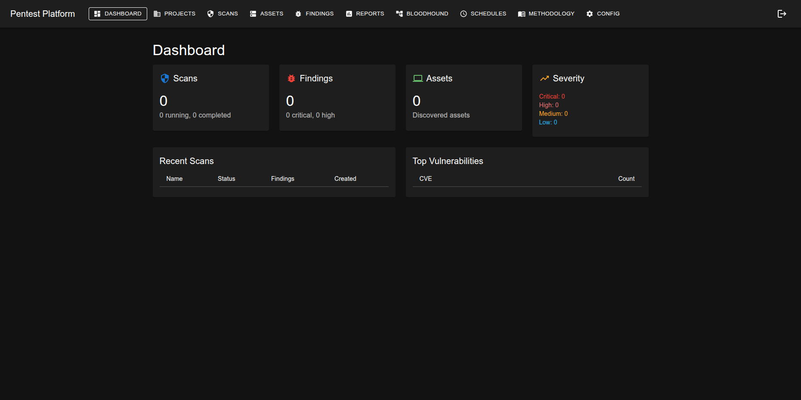

# Docker-PT: Professional Pentesting Platform

> A fully containerized, AI-powered penetration testing platform built on Kali Linux. 40+ security tools, 8 AI providers, full automation, and a modern React UI — all in a single Docker container.


---

## What Is This?

Docker-PT is a single-container pentest lab that packages everything a penetration tester needs:

- **40+ security tools** pre-installed and integrated (nmap, Metasploit, BloodHound, SQLMap, Hydra, CrackMapExec, etc.)
- **AI-assisted pentesting** with 8 provider options (Anthropic Claude, OpenAI, Ollama, WhiteRabbit Neo, and more)
- **Fully autonomous pentesting** — point AI at a target and let it plan, scan, exploit, and report
- **Modern web UI** with real-time scan progress, interactive BloodHound graphs, and dashboards
- **Professional reporting** in PDF, HTML, Word, and JSON formats
- **Enterprise features** — RBAC, audit logging, MFA, scan approval workflows, scheduling

It runs as a single privileged Docker container with `--network host` for full network access to your targets.

---

## Quick Start

```bash
# Clone the repo
git clone https://github.com/YOUR_USERNAME/docker-pt.git
cd docker-pt

# Build the container
docker build -f container/Containerfile -t pentest-platform .

# Run it
docker run -d --name pentest \
  --network host \
  --privileged \
  -v pentest-data:/data \
  pentest-platform

# Check logs for your admin password
docker logs pentest 2>&1 | grep "ADMIN CREDENTIALS"

# Open the UI
# http://localhost (web UI)
# http://localhost:8888/api/docs (API docs)
```

On first boot, the login page displays your generated admin credentials. Click "Got it" to dismiss permanently.

You can also set an explicit password:

```bash
docker run -d --name pentest \
  --network host \
  --privileged \
  -e ADMIN_PASSWORD=YourSecurePassword \
  -v pentest-data:/data \
  pentest-platform
```

### Requirements

| | Minimum | Recommended |
|---|---------|-------------|
| CPU | 4 cores | 8+ cores |
| RAM | 8 GB | 16 GB+ (more for local AI) |
| Storage | 50 GB | 200 GB+ |
| GPU | — | Optional (Hashcat, local AI) |

---

## Architecture

```
┌─────────────────────────────────────────────────────────┐
│                    Single Container                      │
│                                                          │
│  ┌──────────┐  ┌──────────────┐  ┌───────────────────┐  │
│  │  Nginx   │  │   React UI   │  │   FastAPI Backend  │  │
│  │  :80     │──│   (Vite)     │  │   :8888            │  │
│  └──────────┘  └──────────────┘  └────────┬──────────┘  │
│                                           │              │
│  ┌──────────┐  ┌──────────────┐  ┌────────┴──────────┐  │
│  │PostgreSQL│  │    Redis     │  │   Celery Workers   │  │
│  │  :5433   │  │    :6379     │  │   (background)     │  │
│  └──────────┘  └──────────────┘  └───────────────────┘  │
│                                                          │
│  ┌──────────┐  ┌──────────────┐  ┌───────────────────┐  │
│  │  Neo4j   │  │  40+ Pentest │  │   AI Providers    │  │
│  │  :7687   │  │    Tools     │  │   (8 supported)   │  │
│  └──────────┘  └──────────────┘  └───────────────────┘  │
└─────────────────────────────────────────────────────────┘
```

| Layer | Technology |
|-------|-----------|
| Frontend | React 18, Material-UI v5, Vite, Recharts, Socket.io |
| Backend | FastAPI, SQLAlchemy, Celery, Pydantic |
| Databases | PostgreSQL (relational), Neo4j (graph/BloodHound), Redis (cache/queue) |
| Container | Kali Linux, Supervisor, Nginx |
| AI | Anthropic, OpenAI, Ollama, WhiteRabbit Neo, Gemini, Ray Serve, LLaMA.cpp |

---

## Security Tools (40+)

### Network Scanning
| Tool | Purpose |
|------|---------|
| **nmap** | Network discovery and port scanning |
| **masscan** | High-speed port scanning |
| **rustscan** | Fast Rust-based port scanner |
| **subfinder** | Subdomain discovery |
| **amass** | Attack surface mapping |

### Web Application Testing
| Tool | Purpose |
|------|---------|
| **SQLMap** | Automated SQL injection |
| **Nikto** | Web server vulnerability scanner |
| **WPScan** | WordPress security scanner |
| **Nuclei** | Template-based vulnerability scanner |
| **Feroxbuster** | Content discovery / directory brute-force |
| **OWASP ZAP** | Web app security scanner |
| **testssl.sh** | SSL/TLS configuration testing |
| **sslscan** | SSL cipher enumeration |
| **whatweb** | Web technology identification |
| **dalfox** | XSS scanning |

### Active Directory
| Tool | Purpose |
|------|---------|
| **BloodHound** | AD attack path mapping (with interactive graph UI) |
| **CrackMapExec** | AD enumeration and exploitation |
| **NetExec** | Network execution framework |
| **Impacket** | Windows protocol toolkit (secretsdump, psexec, etc.) |
| **enum4linux** | SMB/NetBIOS enumeration |
| **Kerbrute** | Kerberos user enumeration |
| **smbmap** | SMB share enumeration |
| **ldapsearch** | LDAP enumeration |
| **Responder** | LLMNR/NBT-NS poisoning |
| **Evil-WinRM** | WinRM shell access |

### Credential Attacks
| Tool | Purpose |
|------|---------|
| **Hydra** | Network authentication brute-force |
| **Hashcat** | GPU-accelerated password cracking |
| **John the Ripper** | Password cracking |
| **Medusa** | Parallel brute-force |

### Post-Exploitation
| Tool | Purpose |
|------|---------|
| **LinPEAS** | Linux privilege escalation enumeration |
| **WinPEAS** | Windows privilege escalation enumeration |
| **Chisel** | TCP/UDP tunneling |
| **Ligolo** | Tunneling and pivoting |
| **pspy** | Unprivileged process monitoring |
| **Empire** | Post-exploitation C2 framework |

### OSINT
| Tool | Purpose |
|------|---------|
| **theHarvester** | Email, subdomain, and name harvesting |
| **recon-ng** | OSINT framework |

---

## AI Integration

Docker-PT supports **8 AI providers** for vulnerability analysis, exploit generation, report writing, false positive detection, and fully autonomous pentesting.

### Providers

| Provider | Type | Privacy | Key Required |
|----------|------|---------|-------------|
| **Anthropic (Claude)** | Cloud | Data sent to API | Yes |
| **OpenAI (GPT-4)** | Cloud | Data sent to API | Yes |
| **Google Gemini** | Cloud | Data sent to API | Yes |
| **GitHub Copilot** | Cloud | Data sent to API | Yes |
| **Ollama** | Local | Full privacy | No |
| **WhiteRabbit Neo** | Local | Full privacy | No |
| **LLaMA.cpp** | Local | Full privacy | No |
| **Ray Serve** | Local | Full privacy | No |

### AI-Powered Features

- **Vulnerability Analysis** — AI assesses business impact, exploitability, and remediation
- **False Positive Detection** — AI reviews findings and flags likely false positives
- **Exploit Generation** — Generate Metasploit modules and custom exploits
- **Report Generation** — AI-enhanced executive, technical, and compliance reports
- **Autonomous Pentesting** — AI plans, executes scans, exploits vulnerabilities, and documents findings with zero human intervention
- **Natural Language Queries** — Ask questions about your findings in plain English

### Privacy Modes

| Mode | Behavior |
|------|----------|
| `strict` | Local AI only (Ollama, WhiteRabbit Neo, LLaMA.cpp) |
| `normal` | Any configured provider |
| `permissive` | All providers, reduced filtering |

Set `AI_LOCAL_ONLY=true` to enforce local-only AI for regulated or sensitive environments.

---

## Autonomous Pentest

The flagship feature. Give the AI a target and a task in plain English:

```bash
curl -X POST http://localhost:8888/api/v1/ai/autonomous-pentest \
  -H "Authorization: Bearer YOUR_TOKEN" \
  -H "Content-Type: application/json" \
  -d '{
    "provider": "anthropic",
    "api_key": "sk-ant-...",
    "task": "Perform a full penetration test on 192.168.1.0/24",
    "targets": ["192.168.1.0/24"]
  }'
```

The AI will:
1. Plan the engagement
2. Run reconnaissance (nmap, subfinder, etc.)
3. Enumerate services and vulnerabilities
4. Attempt exploitation where appropriate
5. Document all findings
6. Generate a report

Supports Anthropic, OpenAI, DeepSeek, Ollama, and any OpenAI-compatible API.

---

## API Overview (196+ Endpoints)

Full interactive docs at `/api/docs` when running.

| Category | Prefix | Description |
|----------|--------|-------------|
| **Auth** | `/api/v1/auth` | Login, register, MFA, OAuth, password reset, first-boot setup |
| **Scans** | `/api/v1/scans` | Create, start, cancel, monitor, automate scans |
| **Findings** | `/api/v1/findings` | Vulnerability management with AI enrichment |
| **Reports** | `/api/v1/reports` | Generate and download PDF/HTML/Word/JSON reports |
| **Projects** | `/api/v1/projects` | Engagement and scope management |
| **Assets** | `/api/v1/assets` | Asset inventory and tracking |
| **AI** | `/api/v1/ai` | Text generation, analysis, autonomous pentest |
| **BloodHound** | `/api/v1/bloodhound` | AD data collection and Cypher queries |
| **Config** | `/api/v1/config` | System configuration (admin only) |
| **Schedules** | `/api/v1/schedules` | Cron, daily, weekly, monthly scan scheduling |
| **Dashboard** | `/api/v1/dashboard` | Statistics, risk scores, trends, compliance |
| **Methodology** | `/api/v1/methodology` | OSWE/OSEP/OSED phase guidance |
| **Metasploit** | `/api/v1/metasploit` | Module search, exploit execution |
| **WebSocket** | `/api/v1/websocket` | Real-time scan progress and dashboard updates |
| **Analytics** | `/api/v1/analytics` | Advanced analytics and ML insights |
| **Notifications** | `/api/v1/notifications` | Slack, Teams, SIEM, email webhooks |

---

## BloodHound Integration

Full BloodHound support with an interactive web-based graph viewer:

- Automated SharpHound data collection
- Neo4j graph database (built-in)
- Pre-built Cypher queries:
  - Shortest paths to Domain Admin
  - Kerberoastable users
  - AS-REP roastable accounts
  - Unconstrained delegation
- Interactive attack path visualization in the browser

---

## First Login & Password Setup

On first boot, the platform generates a random admin password. There are three ways to get it:

### 1. Login Page Banner (Recommended)
Open the web UI at `http://localhost`. A blue info banner appears below the login form showing your generated username and password. Click **"Got it"** to dismiss it permanently.

### 2. Docker Logs
```bash
docker logs pentest 2>&1 | grep "ADMIN CREDENTIALS"
```

### 3. Set Your Own Password
Pass `ADMIN_PASSWORD` as an environment variable at startup:
```bash
docker run -d --name pentest \
  --network host --privileged \
  -e ADMIN_PASSWORD=YourSecurePassword \
  -v pentest-data:/data \
  pentest-platform
```

> **Important:** Change the default password after first login via the Settings page. The first-boot banner only appears once — after you dismiss it or change the password, it's gone.

---

## Security Hardening

This platform has been hardened for real-world use:

- **Random credentials** — Admin password generated on first boot, displayed on login page once
- **JWT authentication** — All API endpoints require valid tokens
- **Rate limiting** — Login: 10/min, global: 100/min
- **Command injection prevention** — Allowlisted tools only, all inputs sanitized with `shlex.quote()`
- **Account lockout** — Automatic lockout after failed login attempts
- **Security headers** — Strict CSP, X-Frame-Options DENY, HSTS
- **CORS restrictions** — Configured origins only
- **Encrypted credential storage** — AES-256 for stored passwords and API keys
- **Audit logging** — All actions logged, 365-day retention
- **Scan safety** — Target validation, IP range blocking, concurrent scan limits
- **No exposed database ports** — PostgreSQL, Redis, Neo4j are container-internal only
- **MFA support** — TOTP-based two-factor authentication
- **Scan approval workflows** — Require admin approval for sensitive scans

---

## Methodology Support

Built-in methodology guidance based on Offensive Security frameworks:

- **OSWE** — Web application exploitation methodology
- **OSEP** — Active Directory and enterprise exploitation
- **OSED** — Binary exploitation and shellcoding
- **Custom** — Define your own methodology phases

The platform guides you through phases: Reconnaissance, Enumeration, Exploitation, Post-Exploitation, and Reporting — with tool recommendations at each step.

---

## Configuration

All configuration via environment variables:

```bash
# Security (auto-generated if not set)
SECRET_KEY=               # App secret key
JWT_SECRET=               # JWT signing key
ADMIN_PASSWORD=           # Explicit admin password (or random on first boot)

# AI Providers
AI_ENABLED=true
AI_LOCAL_ONLY=false       # Set true for full privacy
AI_PRIVACY_MODE=normal    # strict | normal | permissive
ANTHROPIC_API_KEY=        # Claude API key
OPENAI_API_KEY=           # GPT API key
OLLAMA_BASE_URL=http://localhost:11434
OLLAMA_MODEL=llama2

# Scanning
MAX_CONCURRENT_SCANS=5
MAX_SCAN_DURATION=3600

# Email (for automated report delivery)
SMTP_ENABLED=false
SMTP_HOST=
SMTP_PORT=587
SMTP_USE_TLS=true
EMAIL_FROM=noreply@localhost

# Logging & Debug
LOG_LEVEL=INFO
DEBUG=false
AUDIT_ENABLED=true
```

See `container/entrypoint-single.sh` for all 40+ configurable variables.

---

## Project Structure

```
docker-pt/
├── backend/                        # FastAPI backend
│   ├── app/
│   │   ├── api/v1/                # 46 endpoint modules (196+ routes)
│   │   ├── models/                # 12 SQLAlchemy models
│   │   ├── services/              # 30+ business logic services
│   │   │   ├── ai/               # AI provider abstraction layer
│   │   │   │   └── providers/    # 8 AI provider implementations
│   │   │   └── tool_runners/     # 43 security tool integrations
│   │   ├── core/                  # Auth, config, security, middleware
│   │   └── tasks/                 # Celery background tasks
│   └── main.py
├── frontend/                       # React 18 + Material-UI
│   └── src/
│       ├── pages/                 # 13 pages
│       ├── components/            # BloodHound graph, navigation, etc.
│       └── services/              # Axios API client
├── container/                      # Docker build files
│   ├── Containerfile              # Kali Linux base + all tools
│   ├── entrypoint-single.sh      # Startup orchestration
│   ├── supervisord.conf           # Process manager
│   └── nginx.conf                 # Reverse proxy
├── claude_code_bridge.py          # Host-side Claude Code AI bridge
├── mcp_pentest_server.py          # MCP protocol server for Claude
├── docker-compose-single.yml      # Single-container deployment
└── README.md
```

---

## Screenshots



*The main dashboard showing scan activity, vulnerability breakdown, risk scores, and recent findings.*

---

## Contributing

This project is in active development and **needs contributors**. Whether you're a security professional, full-stack developer, or just getting into offensive security — there's work to do.

### Areas Where We Need Help

| Area | Examples |
|------|---------|
| **Frontend** | Better dashboards, scan wizards, finding detail views, dark/light toggle |
| **Tool Runners** | Integrate new security tools — add a file to `tool_runners/` |
| **AI Providers** | DeepSeek, Mistral API, local model optimizations |
| **Report Templates** | NIST, PCI-DSS, ISO 27001, HIPAA compliance templates |
| **Testing** | Unit tests, integration tests, CI/CD pipeline |
| **Documentation** | Setup guides, video walkthroughs, tool-specific docs |
| **BloodHound** | More pre-built queries, better graph visualization |
| **Exploit Templates** | Pre-built modules for common CVEs |
| **Bug Fixes** | Check the Issues tab |
| **UI/UX** | Mobile responsiveness, accessibility, better workflows |

### How to Get Involved

**→ [Comment on Issue #1](https://github.com/thehackersloth/docker-pt/issues/1) to introduce yourself and request collaborator access.**

Or just dive in:

1. Fork the repo
2. Create a feature branch (`git checkout -b feature/your-feature`)
3. Make your changes
4. Submit a PR with a clear description of what you changed and why

### Development Setup

```bash
# Backend (Python 3.11+)
cd backend
pip install -r requirements.txt
uvicorn main:app --reload --port 8888

# Frontend (Node 18+)
cd frontend
npm install
npm run dev
```

---

## Disclaimer

This tool is designed for **authorized penetration testing and security assessments only**. Always obtain proper written authorization before testing any systems you do not own. Unauthorized access to computer systems is illegal. The authors are not responsible for misuse of this software.

---

## License

This project is licensed under the **GNU Affero General Public License v3.0 (AGPL-3.0)** with the **Commons Clause** restriction.

**You CAN:**
- Use it freely for personal, educational, and internal business use
- Modify it and distribute your modifications (under the same license)
- Use it as a tool for paid penetration testing work (using the software to do your job is fine)

**You CANNOT:**
- Sell the software itself as a commercial product
- Fork it and offer it as a paid SaaS or managed service
- Rebrand and sell it

See [LICENSE](LICENSE) for the full legal text.

---

## Acknowledgments

Built on the shoulders of open source. Thanks to the teams behind Kali Linux, nmap, Metasploit, BloodHound, FastAPI, React, PostgreSQL, Neo4j, and every other tool and library that makes this possible.

---

**Star the repo if it's useful. Open an issue if it's not.**
